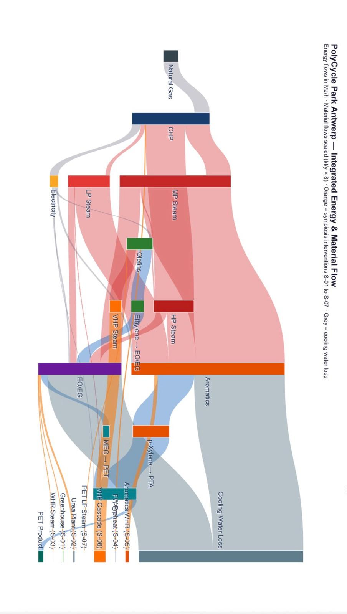
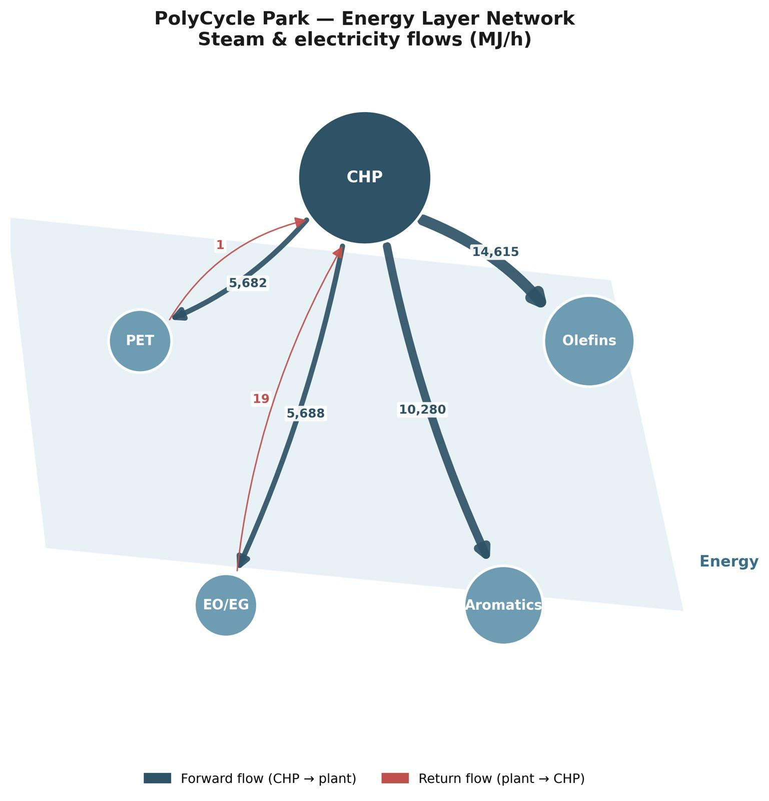

# polycycle-port

  

Industrial symbiosis and energy-systems modelling for a circular-economy retrofit of a petrochemical industrial park (4413INTPR – Integrated Project, Industrial Track, MSc Industrial Ecology, TU Delft/Leiden, Feb–Jun 2026).

The case is **PolyCycle Port**, a five-plant cluster at the Port of Antwerp–Bruges (CHP, Olefins, Aromatics, EO/EG, PET) connected through shared steam, electricity, material, and water flows.

> **Note on contributions.** Group project, 6 members (Rasoul Babaei Dargani, Andrew, Salih Ali, Juting Hsu, Mona Mirzaei, Chang Ann Chen), instructors Paola Ibarra González and Gijsbert Korevaar. Per the project's official contribution record, I participated in Chapters 1–6 and 9, both main presentations, the post-feedback revision pass, and final review.

## Assessment

**Final grade: 9.0/10** — 4413INTPR Integrated Project, Industrial Systems track, TU Delft (2026)

## My contributions

- **Chapter 3** — the full stakeholder analysis section, including the bridging discussion connecting Chapter 3's stakeholder/conceptual framing to Chapter 5's technical flows

- **Chapter 6.1.2** — the integrated system representation: a Sankey diagram (energy + material flow) and a static system-integration diagram, both covering all five plants and all seven symbiosis interventions (S-01–S-07)

- **Chapter 5** — the technical/energy-analysis methodology (energy balance approach, KPI/performance evaluation, pinch and utility matching) and the complete EO/EG plant analysis with all of its interventions (S-01 HTHP, S-02 CO₂ capture, S-03 waste-heat recovery)

- **Full-park Linny-R energy network model** — the energy/intervention network spanning all five plants and all seven interventions (S-01–S-07)

- **Multilayer network analysis** of the park's plant cluster across Energy and Materials layers (degree, betweenness, strength, participation coefficient, composite multiplex importance ranking)

- **Section 9.3** — the final conclusions

The CHP Utility-Hub Retrofit (Chapter 6 system representation, TONF structure, trade-off matrix, economics, spider diagram) was led by a teammate, not by me. The park-wide material-balance Linny-R network underlying the Chapter 6.1.2 diagrams was also built by the group rather than individually by me.

## Repository contents

| Component | Description | Mine / Team |
| - | - | - |
| Stakeholder analysis | Park stakeholder mapping, interests, dependencies, and the Ch.3→Ch.5 bridging discussion — see [final report](PolyCycle_Port_Final_Report.pdf) | Mine |
| [Sankey diagram](sankey_polycycle.py) | Interactive energy + material flow visualization, all 5 plants + 7 interventions (Chapter 6.1.2) — [rendered output](6_1_2_sankey_polycycle.html) | Mine |
| EO/EG energy analysis | Full energy-balance evaluation and intervention design for S-01–S-03 (Chapter 5) — see [final report](PolyCycle_Port_Final_Report.pdf) | Mine |
| [Energy/intervention Linny-R model](Full-Park-Network-With-Intervention.lnr) | Full-park network covering all 5 plants and 7 interventions (S-01–S-07) | Mine |
| [Multilayer SNA](energy_layer_network_analysis.ipynb) | Multiplex network analysis of the 5-plant cluster across Energy and Materials layers — degree, betweenness, strength, participation coefficient, interlayer connectivity, and a composite multiplex importance ranking | Mine |
| Conclusions | Cross-intervention synthesis and final recommendation (Section 9.3) — see [final report](PolyCycle_Port_Final_Report.pdf) | Mine |

<p float="left">
  
  
  
</p>

*Left: Sankey diagram (Chapter 6.1.2). Middle: energy-layer network analysis. Right: Linny-R network view — EO/EG plant utilities detail (part of the full-park model, not the full 5-plant network).*


## Key results

- **EO/EG four-intervention package** (S-01–S-03 + centralised WWTP) — diagnosed as the park's highest-emission, highest-waste-heat plant after correcting a kt-vs-t unit error in the original CO₂-avoidance accounting that had affected its ranking against the CHP retrofit. Not advanced as the project's primary recommendation since equivalent costing depth wasn't developed for it in this project's scope; flagged as the strongest candidate for assessment once the CHP retrofit is underway.

- **Multilayer SNA finding:** CHP is the park's central *energy* hub, but EO/EG comes out as the most-networked node overall once both the Energy and Materials layers are combined — two different but compatible framings, not a contradiction, reflecting the different scope of "energy hub" vs. "most interconnected across the full symbiosis network."

- **CHP Utility-Hub Retrofit** (teammate's work) — ~651 tCO₂/y avoided, the only intervention in scope with a full investment-grade economic case, and ultimately the project's headline recommendation.

## Repository structure

```
polycycle-port/  
├── report/  
│   └── PolyCycle\_Port\_Final\_Report.pdf       \# full 102-page final submission  
├── linnyr/  
│   ├── Full-Park-Network-With-Intervention.lnr   \# energy/intervention network, S-01–S-07 (mine)  
│   └── S01-S07\_Intervention\_Table.md              \# supplementary table documenting S-01–S-07 (mine)  
├── analysis/  
│   ├── sankey\_polycycle.py                    \# interactive Plotly Sankey source (mine)  
│   └── 6\_1\_2\_sankey\_polycycle.html             \# rendered Sankey output (mine)  
└── sna/  
    └── multilayer\_sna.ipynb                   \# multilayer stakeholder/process network analysis (mine)
```

## Tools used

Linny-R (network/energy-material flow modelling), Python — Plotly for the interactive Sankey diagram, matplotlib for the system integration diagram and EO/EG energy analysis, pandas for data handling — and social network analysis (NetworkX/pymnet).

